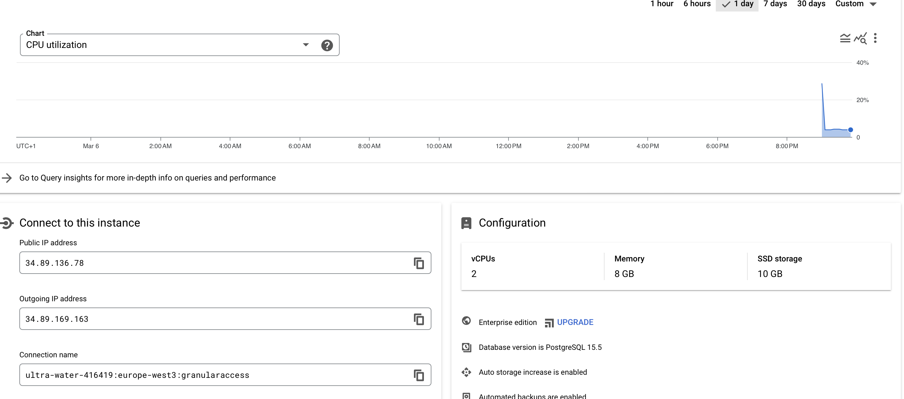

### Database choice
PostgreSQL:

Pros:

Enhanced Security: PostgreSQL offers granular access control, enabling fine-grained control over database objects, reducing the risk of unauthorized access.
Flexible Permission Management: The database allows administrators to define detailed access controls at various levels, accommodating diverse security requirements.
Compliance Support: PostgreSQL's access control capabilities aid in meeting compliance requirements, such as GDPR, HIPAA, or PCI DSS, by enforcing strict access controls and facilitating effective audit trails.
Isolation of Responsibilities: Assigning specific privileges to roles or users helps maintain the principle of least privilege, reducing the risk of unauthorized access or misuse.
Auditability: PostgreSQL's granular access controls facilitate comprehensive auditing of database activities, crucial for maintaining accountability and compliance.
Cons:

Complexity: Implementing and managing granular access control in PostgreSQL can be complex, especially in environments with numerous users and intricate permission requirements.
Performance Overhead: Fine-grained access controls may introduce some performance overhead, particularly in scenarios involving complex permission checks.
Administration Overhead: Managing granular access control configurations requires ongoing administration, including regular reviews and updates.
Potential for Misconfiguration: There is a risk of misconfigurations or errors, requiring thorough testing, documentation, and adherence to best practices.
Compatibility Considerations: Some applications or frameworks may not fully support PostgreSQL's granular access control features, leading to compatibility issues.
In summary, PostgreSQL is chosen for its enhanced security, flexible permission management, and robust compliance support. While it may introduce complexity and performance considerations, the database's features align well with the requirements of large systems and organizations seeking a high level of security and control over data access.

### Documentation postgreSQL deployment

