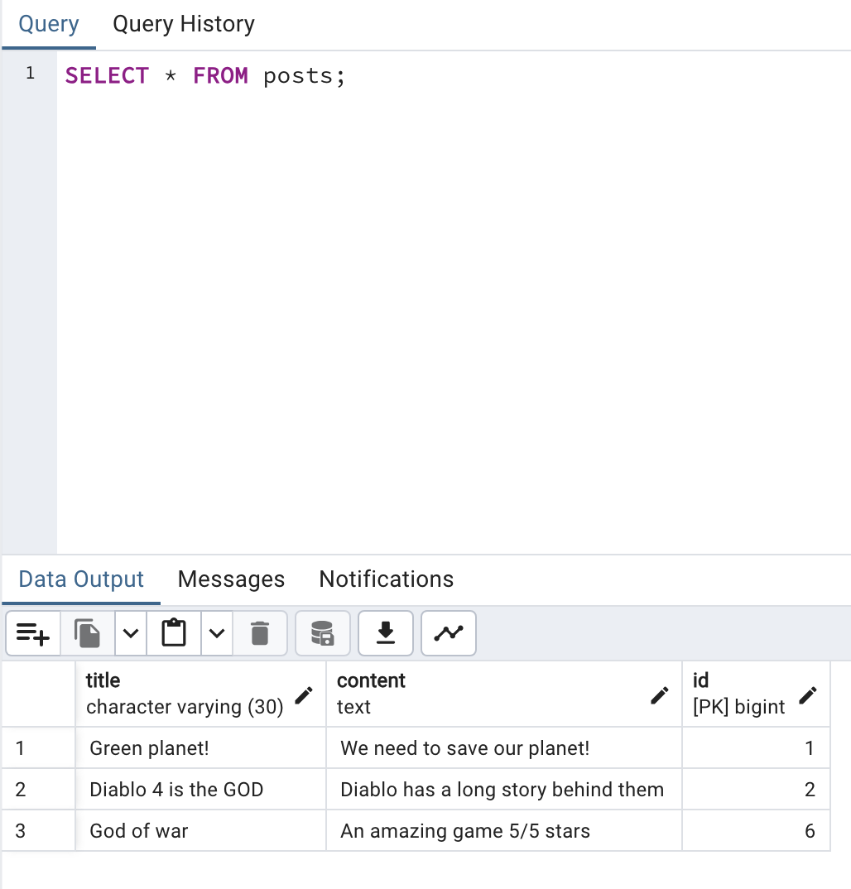
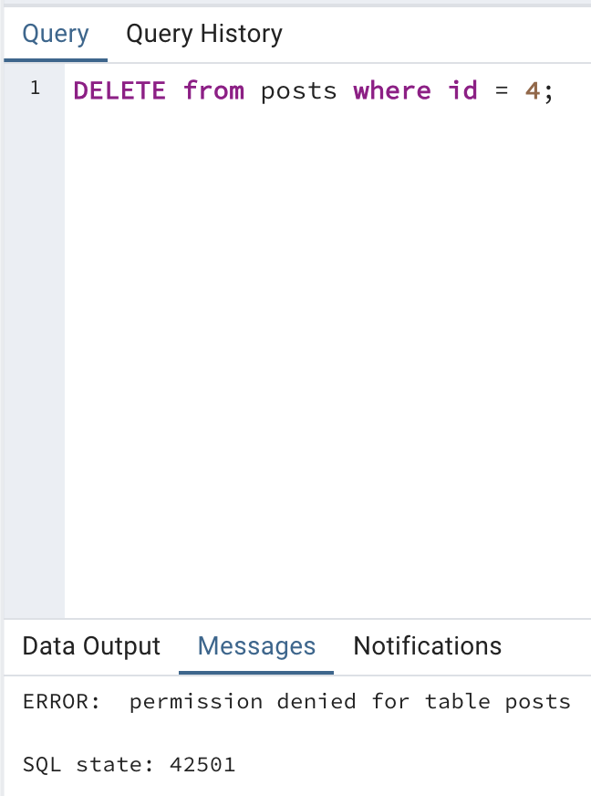

Github Repo: [click here](https://github.com/Rasmus-Kibshede/si_lecture_kea_2024/blob/main/00._Tasks/04._/04b._Database_granular_access/Exposee.md)
### CRUD items

### CRUD posts

### CRUD users

### CRUD secrets

