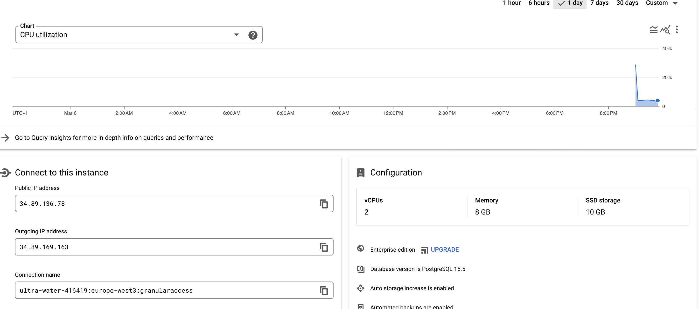
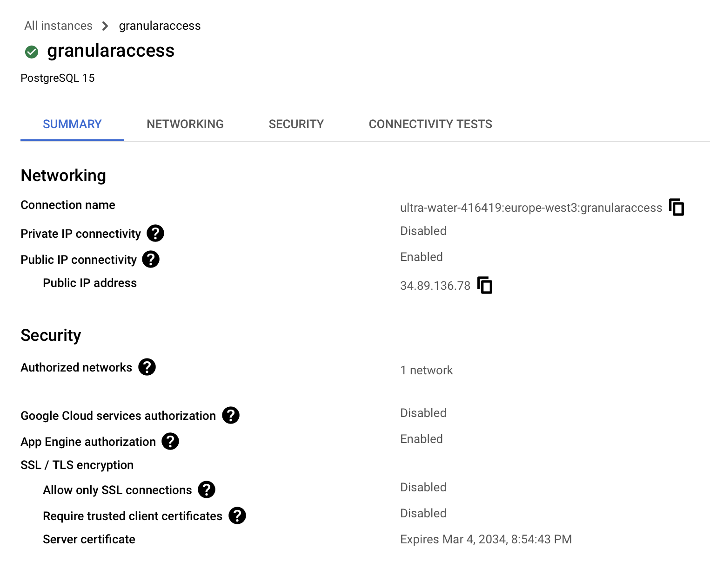
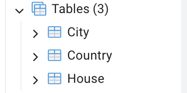
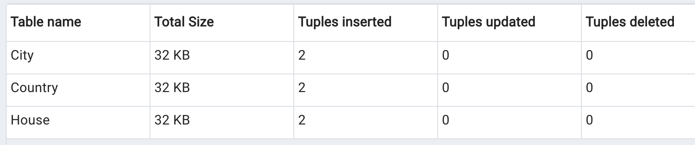

# Database Granular Access Documentation

### Connection string postgreSQL
psql "sslmode=require hostaddr=34.89.136.78 user=Rasmus dbname=postgres" 
password: Rasmus1234

### Tables
| Table name      | Permission              | 
|-----------------|-------------------------|
| City            | Full access             |
| House           | Read only               |
| Country         | No access               |

### Documentation postgreSQL deployment

