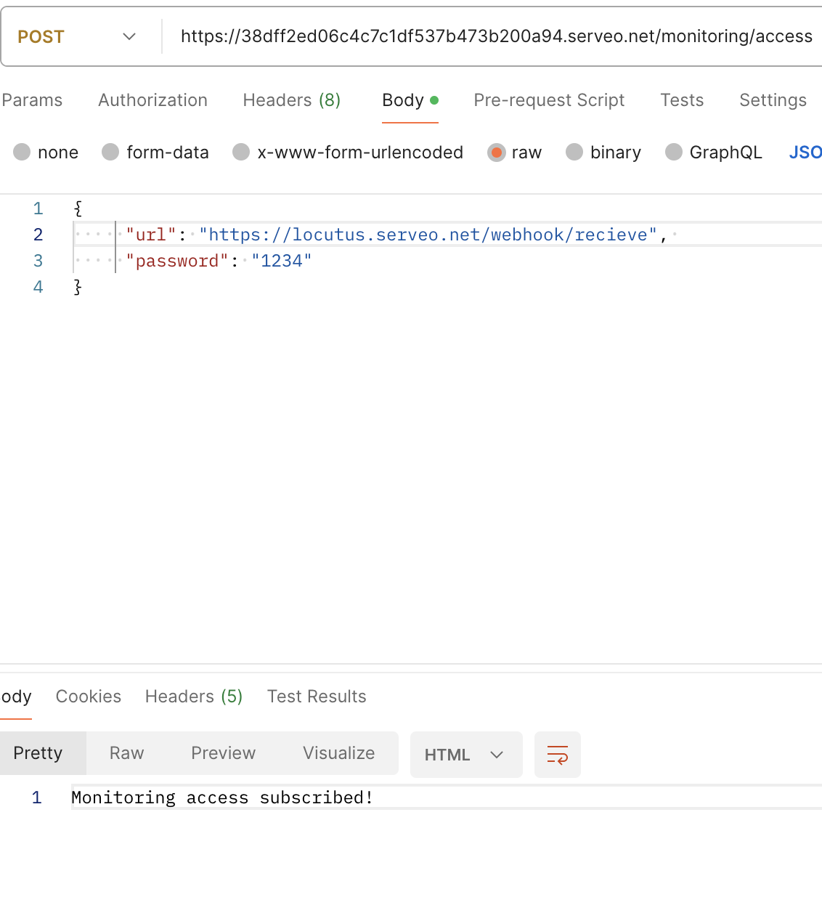

* Understands the pros and cons of SSE and can compare it to Websockets.
** SSE

- Browsers can subscribe to a stream of events generated by a server using the EventSource interface, receiving updates whenever a new event occurs. 
- Server-Sent Events is a standard describing how servers can maintain data transmission to clients after an initial client connection has been established

PROS: 
- Built-in support for reconnection: Server-Sent Event connections will reestablish a connection after it is lost, meaning less code to write to achieve an essential behavior.
- No firewall blocking: SSEs have no trouble with corporate firewalls doing packet inspection, which is important for supporting apps in enterprise settings.

CONS: 
- Data format limitations. Server-Sent Events are limited to transporting UTF-8 messages; binary data is not supported.
- Limited concurrent connections. You can only have six concurrent open SSE connections per browser at any one time. This can be especially painful when you want to open multiple tabs with SSE connections. 
- SSE is mono-directional. You can only send messages from server to client. While this is useful for creating read-only realtime apps like stock tickers, it is limiting for many other types of realtime app.

```
var SSE = require('express-sse');
var sse = new SSE();
app.get('/stream', sse.init);
// we can always call sse.send from anywhere the sse variable is available, and see the result in our stream.

let content = 'Test data at ' + JSON.stringify(Date.now());
sse.send(content);
```

** WebSockets

- WebSockets are a thin transport layer built on top of a device's TCP/IP stack, which provides full-duplex, low-latency, event-driven connections between the server and the browser.
- Uses a custom ws protocol to transport messages, which works at a lower level than HTTP.
- Connection is two-way, so WebSockets are useful for apps that require data to be read from and written to the server, such as chat apps or multiplayer games.

PROS:
- Fallback to HTTP, Socket.IO
- Resource efficiency: Due to being a low-level protocol, a single WebSocket connection can handle a high bandwidth on a single connection.
- WebSockets offer bi-directional communication in realtime: Because WebSocket provides a full-duplex, bi-directional communication channel, the server can send messages to the client, and both can send messages at the same time.
- Data format flexibility: WebSockets can transmit binary data and UTF-8 meaning that apps can support sending plain text and binary formats such as images and video.

CONS: 
- Firewall blocking: Some enterprise firewalls with packet inspection have trouble dealing with WebSockets (notably SophosXG Firewall, WatchGuard, and McAfee Web Gateway).
- No built-in support for reconnection: When a WebSocket connection is closed (e.g. due to network issues), the client does not try to reconnect to the server, which means you’ll need to write extra code to poll the server, re-establishing the connection when it is available again.

```
const WebSocket = require('ws');

const wss = new WebSocket.Server({ port: 8080 });

wss.on('connection', function connection(ws) {
  ws.on('message', function incoming(message) {
    console.log('received: %s', message);
  });

  ws.send('something');
});
```

BROWSER: 
```
const ws = new WebSocket('ws://example.org');

ws.addEventListener('open', () => {
  // Send a message to the WebSocket server
  ws.send('Hello!');
});
 
ws.addEventListener('message', event => {
  // The `event` object is a typical DOM event object, and the message data sent
  // by the server is stored in the `data` property
  console.log('Received:', event.data);
});
```


** Can recall how we did Github Webhooks without having to be able to do it on the fly. Can illustrate exactly how it works by drawing a diagram.

- Webhooks are automated, in other words, they are automatically sent out when their event is fired in the source system.
- This provides a way for one system (the source) to “speak” (HTTP request) to another system (the destination) when an event occurs, and share information (request payload) about the event that occurred.


- Can create a "Hello World" Git hook.

- Understands how to approach building a custom webhook system.


### User Guide
Create a webhook with one of the endpoints, add the body to the post. 
| Method   | Url                                          | Description                            | Body   |
|----------|----------------------------------------------|----------------------------------------|--------|
| POST     | https://locutus.serveo.net/payment/refunded  | Subscribe on payment refund events     |    X   |
| POST     | https://locutus.serveo.net/payment/success   | Subscribe on Payment success events    |    X   |
| POST     | https://locutus.serveo.net/payment/failed    | Subscribe on Payment failed events     |    X   |

### Body Example
```` Json 
{
    "url": "your url here"
}
````

### API Endpoints
| Method   | Url                                          | Description                            | Body   |
|----------|----------------------------------------------|----------------------------------------|--------|
| GET      | https://locutus.serveo.net/ping              | Sends events to all subscribers        |        |
| POST     | https://locutus.serveo.net/payment/refunded  | Subscribe on payment refund events     |    X   |
| POST     | https://locutus.serveo.net/payment/success   | Subscribe on Payment success events    |    X   |
| POST     | https://locutus.serveo.net/payment/failed    | Subscribe on Payment failed events     |    X   |
| DELETE   | https://locutus.serveo.net/payment/refunded  | Unsubscribe on payment refund events   |    X   |
| DELETE   | https://locutus.serveo.net/payment/success   | Unsubscribe on Payment success events  |    X   |
| DELETE   | https://locutus.serveo.net/payment/failed    | Unsubscribe on Payment failed events   |    X   |


### Integrator documentation





