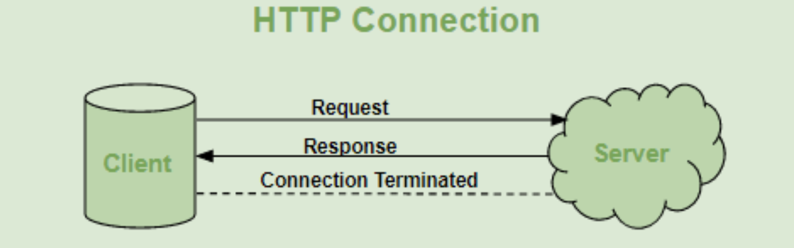
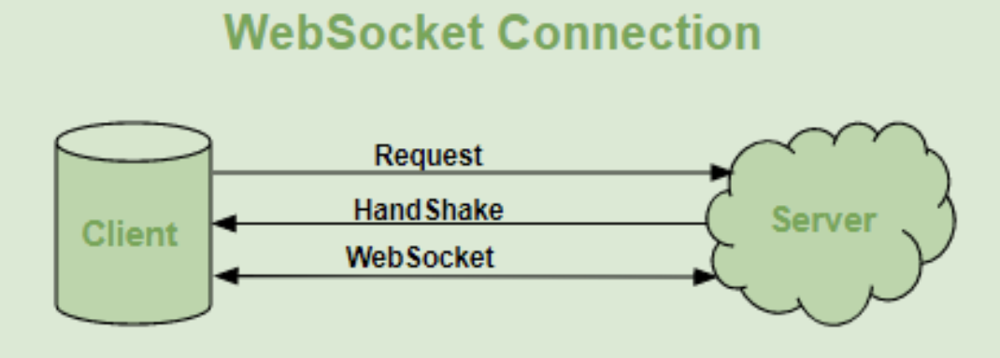

Knows about different communication protocols on a superficial level.

- HTTP HyperText Transfer Protocol, Client server model, stateless each request-response pair is independent dosnt store any previous data.
- HTTPS HyperText Transfer Protocol Secure, Encrypted TLS(Transfer layer Secrurity), 
- WebSocket  Bidirectional, stateful connection will be kept alive until terminated. Good for gaming & chat applications.
- TCP (Transmission control protocol) organizes data so that it can be transmitted between a server and a client.
- UDP User Datagram Protocol, is a communication protocol used across the Internet for especially time-sensitive transmissions such as video playback or DNS lookups.
- AMQP Advanced Message Queuing Protocol AMQP is an application layer protocol that lets client applications talk to the server and interact. AMQP defines both the network layer protocol and a high-level architecture for message brokers.
- SSH Secure Shell  network protocol that gives users, particularly system administrators, a secure way to access a computer over an unsecured network.

Knows how to make a HTTP requests between languages.
08. Server to server Node - Python

Understand the different levels of environment variables and how they differ.
- System env - homebrew (manager til system env)
- Application env .env fil
 

Knows how to define environment variables in different languages.
09. Environment Variables
js 
```
process.env.MYSQL_USER
```
python
```
import os
os.environ['HOME']
os.environ.get('KEY_THAT_MIGHT_EXIST')
```