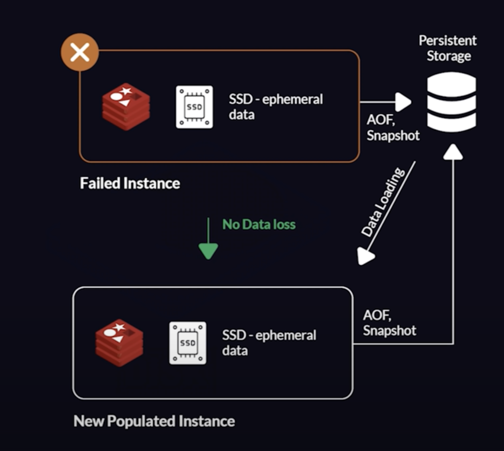
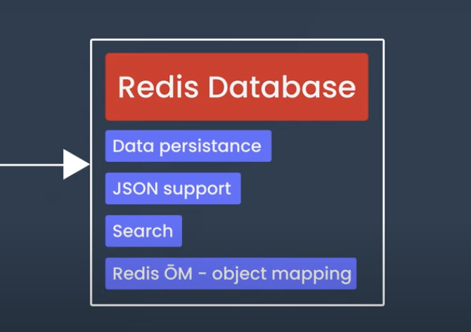

Can document and backup MySQL
08a._document_database

Has considered how to document the databases they are familiar with.

Can list several of the things that Redis can be used for.

- In memory multi model database: Extreamely fast
- Remote dictionary server
- Key value store
- Used to cashe data in ram and drive. 
- Can be used as support database or main database

Can do basic operations in Redis in the CLI with help.
- set age 32
- set name 'test'
- del name
- get age
- mset name 'hej' age 32 color blue
- mget name age color
- getrange color 2
- lpush pushes a value into a list.
- LPUSH key element [element ...]
click refresh