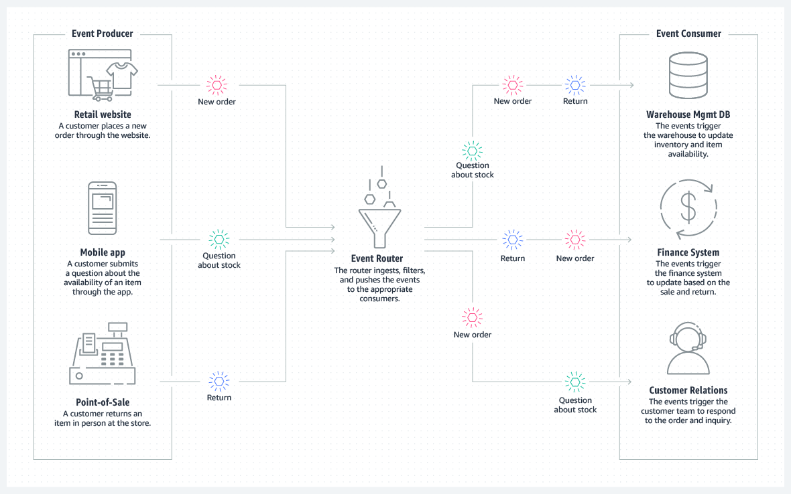

Can generate OpenAPI documentation in their favorite(s) frameworks.
https://github.com/SWKEA2023/CinemaAPI
Swagger --> OpenAPI

Understand event-driven architecture and what it aims to solve.
- uses events to trigger and communicate between decoupled services
- Scale and fail independently

Can think of cases where event-driven architecture is useful.
- e-commerce site with multiple interfaces front-end: app, retail website, instore 
- e-commerce site with multiple interfaces front-end: Finance, validate payment. Warehouse management, Customer relations

Understands what Pub/sub and Streams are and can contrast and compare.
- Redis
- RabbitMQ 
- Messaging services that can decouple services and introduce asynchrous communication. 

Can compare Redis with RabbitMQ and Kafka.
RabbitMQ is primarily a message broker, Redis is used as an in-memory data store and caching solution
- Redis stack: Database, cashing 
- RabbitMQ: primarly a message broker
- kafka: High amounts of data and high speed multiple producers and consumers. Consumers can consume a message or a whole que at one time. Mainly focused towards JAVA 

Kafka excels in handling large amounts of data and high message throughput with strong durability and fault-tolerance capabilities. RabbitMQ offers good scalability and flexible delivery semantics. Redis is suitable for caching and small-scale pub/sub scenarios, but lacks advanced features like message persistence and fault-tolerance.

Understands the problem that GraphQL solves.
- aggregating data from multiple sources or APIs and then resolving the data to the client in a single API call
- only send the data that the client requests.
- GraphQL exposes a single endpoint that allows you to access multiple resources