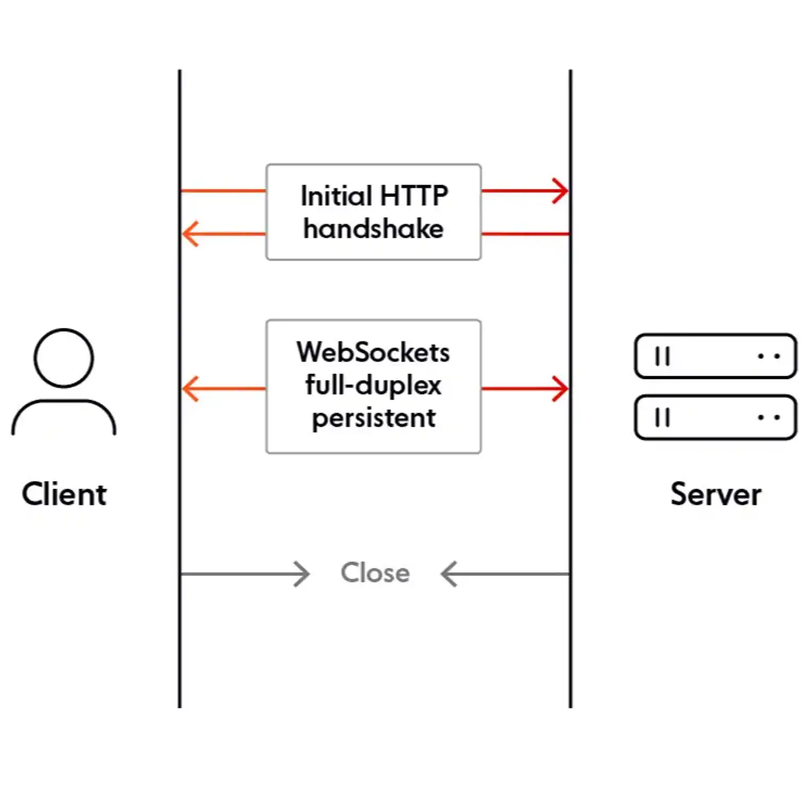
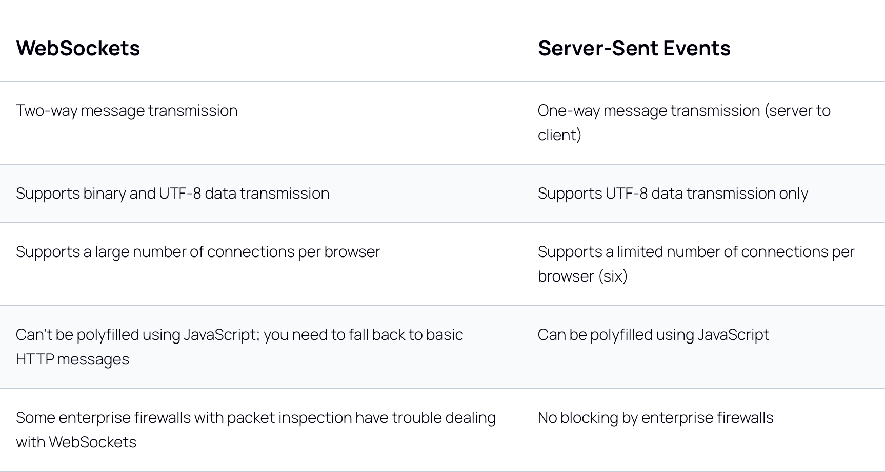

Can explain how the web sockets works.

- WebSockets are a thin transport layer built on top of a device's TCP/IP stack, which provides full-duplex, low-latency, event-driven connections between the server and the browser.
- Uses a custom ws protocol to transport messages, which works at a lower level than HTTP.
- Connection is two-way, so WebSockets are useful for apps that require data to be read from and written to the server, such as chat apps or multiplayer games.

PROS:
- Fallback to HTTP, Socket.IO
- Resource efficiency: Due to being a low-level protocol, a single WebSocket connection can handle a high bandwidth on a single connection.
- WebSockets offer bi-directional communication in realtime: Because WebSocket provides a full-duplex, bi-directional communication channel, the server can send messages to the client, and both can send messages at the same time.
- Data format flexibility: WebSockets can transmit binary data and UTF-8 meaning that apps can support sending plain text and binary formats such as images and video.

CONS: 
- Firewall blocking: Some enterprise firewalls with packet inspection have trouble dealing with WebSockets (notably SophosXG Firewall, WatchGuard, and McAfee Web Gateway).
- No built-in support for reconnection: When a WebSocket connection is closed (e.g. due to network issues), the client does not try to reconnect to the server, which means you’ll need to write extra code to poll the server, re-establishing the connection when it is available again.

```
const WebSocket = require('ws');

const wss = new WebSocket.Server({ port: 8080 });

wss.on('connection', function connection(ws) {
  ws.on('message', function incoming(message) {
    console.log('received: %s', message);
  });

  ws.send('something');
});
```

BROWSER: 
```
const ws = new WebSocket('ws://example.org');

ws.addEventListener('open', () => {
  // Send a message to the WebSocket server
  ws.send('Hello!');
});
 
ws.addEventListener('message', event => {
  // The `event` object is a typical DOM event object, and the message data sent
  // by the server is stored in the `data` property
  console.log('Received:', event.data);
});
```



WebSocket is a bidirectional communication protocol that allows real-time, full-duplex communication between clients and servers. Unlike traditional HTTP, which operates on a request-response model, WebSocket establishes a persistent connection, enabling efficient and continuous data exchange.

Pros:
- Enables full-duplex communication, allowing for real-time bidirectional data exchange.
- Low latency and suitable for applications requiring immediate updates (e.g., chat applications, online gaming).
- Works over a single, persistent connection.

Cons:
- More complex to implement and manage compared to SSE.
- May require additional infrastructure to handle connections, scaling, and security.
- Some proxy servers and firewalls may block WebSocket connections.

Understand WebRTC on a surface level.
- Web Real-Time Communication
- enable real-time communication directly within a web browser. 

PROS:
- WebRTC allows direct communication between browsers, eliminating the need for intermediaries and enabling faster, more efficient data transmission.
- WebRTC provides native support for real-time streaming, enabling high-quality audio and video communication within web applications.
- WebRTC incorporates encryption and authentication mechanisms, ensuring secure and private communication.

CONS: 
- Limited Browser support: WebRTC is widely supported, variations in compatibility across different browsers and platforms can present challenges in reaching a broad user base.
- Establishing direct connections between devices behind firewalls or NAT devices can be challenging, requiring additional configuration for seamless connectivity.
- WebRTC's real-time streaming features can consume significant bandwidth and system resources, which may be a consideration in resource-constrained environments.

Can make comparisons between web sockets and WebRTC.
- WebRTC focuses on real-time audio, video streaming and video conferencing applications
- WebSocket is primarily geared towards data communication, collaborative environments and real-time chat applications.

Understands why CORS exists and how to solve issues.
- Cross-origin resource sharing (CORS) is a mechanism that allows restricted resources on a web page to be requested from another domain outside the domain from which the first resource was served. A web page may freely embed cross-origin images, stylesheets, scripts, iframes, and videos.

- Simple requests

A simple request is one that uses methods such as GET, HEAD, or POST. These methods are considered safe because they are not capable of causing a change in state on the server.

- Pre-flighted requests

A pre-flighted request is one that uses a method such as PUT or DELETE. These methods can cause a change in state on the server, so the browser sends a request to the server to check if the request is allowed. The server then responds with the appropriate headers, and if the response is successful, the browser sends the actual request.

CORS provides a number of benefits:
- It allows browsers to enforce the same-origin policy, which is a security measure that prevents a malicious script from accessing resources that it should not have access.
- It allows restricted resources on a web page to be requested from another domain. This can be useful when you want to embed a resource from another domain, such as an image or a video.
- It allows the browser to send a pre-flighted request to the server to check if the request is allowed. This can be useful when you want to make a request that could potentially cause a change in state on the server.